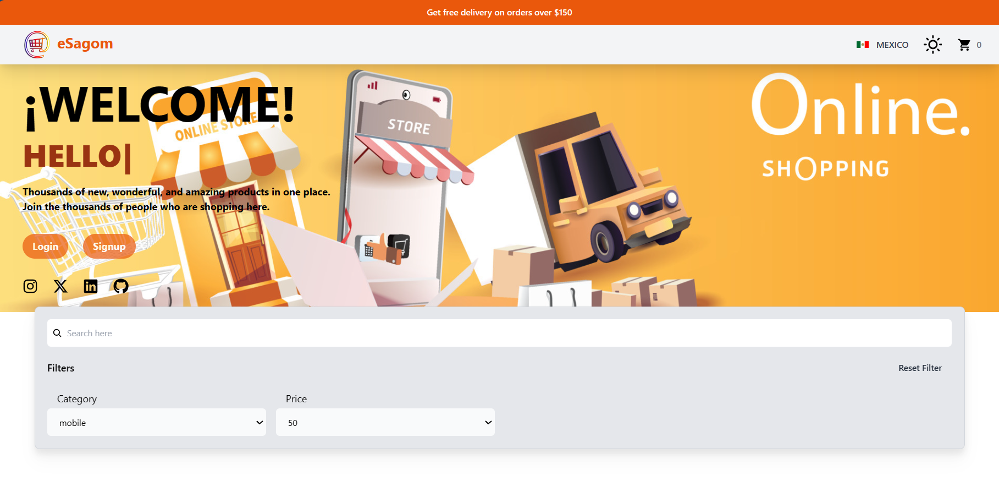
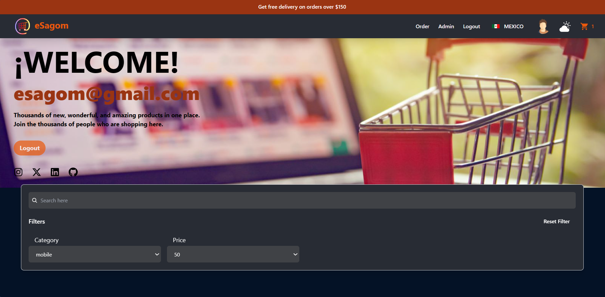
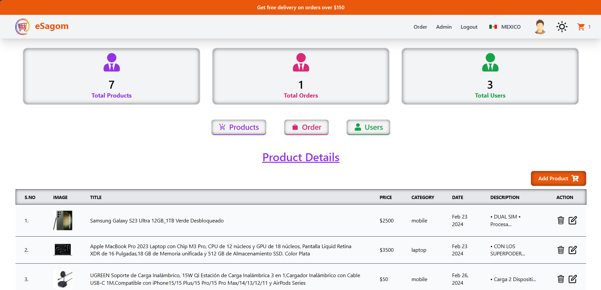

# ecommerce-react

ecommerce-react is a responsive [React](https://react.dev/) application that uses dependencies, firebase, reduxjs/toolkit and tailwindcss.

## Demo

ecommerce-react [eSagom](https://esagom.netlify.app/)

## Installation

If you would like to download the code and try it for yourself:

1. Clone the repo: `git@github.com:EdgarSagom/ecommerce-react.git`
2. `cd ecommerce-react`
3. Install packages: NPM Packages
4. Create an account in [firebase](https://firebase.google.com/) and change the data that is in 'src/firebase/FirebaseConfig.jsx'
5. Build project and launch
6. Open your browser with:

   - `npm run dev`
   - click on: http://localhost:

## NPM Packages

- npm install
- npm install -D [tailwindcss](https://tailwindcss.com/) postcss autoprefixer
- npx tailwindcss init -p
- npm i [react-router-dom](https://reactrouter.com/en/main)
- npm i [@headlessui/react](https://headlessui.com/react/menu)
- npm i [react-icons](https://www.npmjs.com/package/react-icons) --save ([examples of react-icons](https://react-icons.github.io/react-icons/))
- npm i [framer-motion](https://www.npmjs.com/package/framer-motion)
- npm i [react-type-animation](https://www.npmjs.com/package/react-type-animation)
- npm i [react-tabs](https://www.npmjs.com/package/react-tabs)
- npm install [@reduxjs/toolkit react-redux](https://redux-toolkit.js.org/)
- npm install [firebase](https://firebase.google.com/)
- npm i [react-toastify](https://www.npmjs.com/package/react-toastify)

## Create from start

If you want to create the code from scratch in React + Vite:

1. `npm create vite@latest`
2. Create an account in [firebase](https://firebase.google.com/).
3. Follow what is done in the commits
